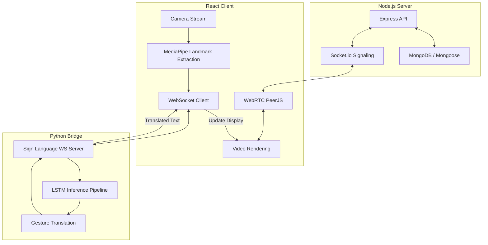

# 🤟 BeyondWords: Real-Time Sign Language Interpretation

<p align="center">
  
  
  
</p>

**BeyondWords** is a state-of-the-art video conferencing and sign language translation platform. It bridges communication gaps by providing real-time AI-powered sign language to speech/text translation within a collaborative meeting environment. Leveraging advanced deep learning and computer vision, it empowers individuals who use sign language to communicate seamlessly in digital spaces.

---

## ✨ Key Features

- **🤖 AI Gesture Recognition**: Uses **MediaPipe** and custom **LSTM (PyTorch)** models to translate hand gestures into words and sentences in real-time.
- **🎙️ Real-Time Communication**: High-quality video conferencing powered by **Socket.io** and **WebRTC (PeerJS)**.
- **🌍 Multi-Language Output**: Supports live translation results in multiple languages (Hindi, German, English).
- **📝 Live Transcription**: Integrated speech-to-text ensures accessibility for everyone.
- **🎨 Premium UI/UX**: Sleek, responsive interface built with **React**, **Tailwind CSS**, and **Framer Motion**.
- **🔒 Secure Architecture**: JWT-based authentication and secure signaling for private meetings.

---

## 🚀 Demo

> [!NOTE]
> Demo video coming soon! Check back for a full walkthrough of the platform in action.

---

## 🏗️ System Architecture

BeyondWords follows a decoupled, three-tier architecture designed for high performance and low-latency inference.



### Data Flow Diagram
1. **Input**: User captures video via the browser.
2. **Processing**: Landmarks are extracted locally or sent to the Python Bridge.
3. **Inference**: The LSTM model processes sequences of 30 frames to predict the gesture.
4. **Output**: The predicted text is broadcasted to all meeting participants via Socket.io.

---

## 🛠️ Tech Stack

### Frontend


### Backend


### AI & Machine Learning


---

## 🧠 Machine Learning Model

The heart of BeyondWords is a custom-trained **Long Short-Term Memory (LSTM)** neural network.

- **Feature Extraction**: MediaPipe Holistic provides 126 features per frame (21 landmarks per hand with X, Y, Z coordinates).
- **Sequence Processing**: The model analyzes a sliding window of **30 frames** to capture the temporal dynamics of signs.
- **Stability Logic**: Implements a `SignSegmenter` that requires consistent predictions over multiple frames before committing a word to the final sentence, ensuring accuracy despite ambient noise or minor hand jitters.

---

## 💻 Getting Started

### Prerequisites
- Node.js v18+
- Python 3.10+
- MongoDB instance (local or Atlas)

### 1. Installation

```bash
# Clone the repository
git clone https://github.com/MdTariq01/BeyondWords.git
cd BeyondWords

# Install Backend dependencies
cd server
npm install

# Install Frontend dependencies
cd ../client
npm install

# Setup Python Bridge
cd ../python_bridge
python -m venv .venv
source .venv/bin/activate  # Windows: .venv\Scripts\activate
pip install -r requirements.txt
```

### 2. Environment Setup
Create a `.env` file in the `server/` directory:
```env
PORT=5000
MONGODB_URI=your_mongodb_connection_string
JWT_SECRET=your_secret_key
```

### 3. Run the Project
Use the provided PowerShell script or start components individually:

**Unified Start:**
```powershell
./start-dev.ps1
```

**Manual Start:**
- **Server**: `cd server && npm run dev` (Runs on port 5000)
- **Client**: `cd client && npm run dev` (Runs on port 5173)
- **Python Bridge**: `cd python_bridge && python sign_ws_server.py` (Runs on port 8765)

---

## 📁 Project Structure

```text
├── client/          # Vite + React Frontend
├── server/          # Node.js + Express Backend
├── python_bridge/   # ML Inference Server (WebSockets)
├── start-dev.ps1    # Development startup script
└── README.md        # Project documentation
```

---

## 🤝 Contributing

We welcome contributions! Whether it's improving the ML model, adding new sign support, or refining the UI.

1. Fork the Project
2. Create your Feature Branch (`git checkout -b feature/AmazingFeature`)
3. Commit your Changes (`git commit -m 'Add some AmazingFeature'`)
4. Push to the Branch (`git push origin feature/AmazingFeature`)
5. Open a Pull Request

---

## 📜 License

Distributed under the MIT License. See `LICENSE` for more information.

---

<p align="center">
  Built with ❤️ for a more inclusive world.
</p>
