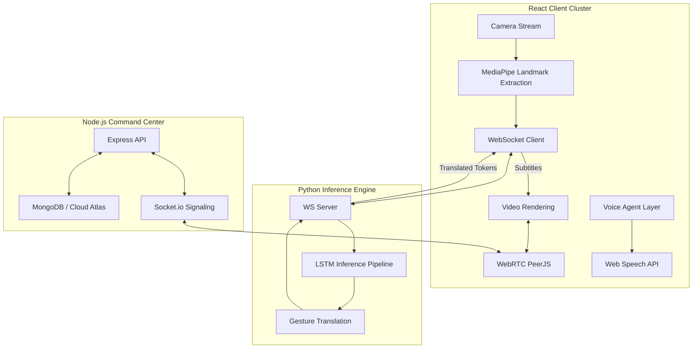

# 🤟 BeyondWords: The Universal & Inclusive Communication Platform

<p align="center">
  
  
  
  
</p>

**BeyondWords** is a state-of-the-art, AI-powered video conferencing platform designed to dissolve communication barriers for *everyone*. Whether you are deaf, dumb, blind, or simply speak a different language, BeyondWords provides the tools to connect seamlessly. 

By integrating real-time sign language interpretation, live universal subtitles, and a voice-controlled command center, we ensure that digital spaces are truly inclusive.

---

## ✨ Key Pillars

### 🤟 Real-Time Sign Language Interpretation
Bridge the gap between visual sign language and spoken words.
- **AI Gesture Recognition**: Uses **MediaPipe** and custom **LSTM (PyTorch)** models to translate hand gestures into text and speech in real-time.
- **Sentence Construction**: Intelligent `SignSegmenter` logic builds coherent sentences from fluent hand movements.

### 🌍 Live Universal Subtitles
Break language barriers with instant, high-accuracy translation.
- **Hindi to English**: Live transcription and translation for Hindi speakers.
- **German to English**: Seamless subtitles for German dialogue.
- **Bi-Directional Layers**: Participants can choose their own "Linguistic Layer" for personalized accessibility.

### 🎓 Gamified Learning Hub
Master new forms of dialogue through an interactive, cognitive-focused curriculum.
- **Sign Language Mastery**: Learn to communicate with others using your hands.
- **German Philology**: Deep dive into German grammar and vocabulary.
- **Nuance Games**: Cognitive exercises designed to sharpen linguistic and contextual understanding.
- **Progression System**: Earn XP, level up your rank, and unlock philological achievements.

### 🎙️ Voice AI Command Center ("Mr. Pineapple")
A fully voice-integrated experience for those with visual impairments or hands-busy situations.
- **Wake-Word Activation**: Simply say *"Mr. Pineapple"* to wake your personal assistant.
- **Intelligent Scheduling**: *"Mr. Pineapple, schedule a meeting for 3 PM"* — automate your workflow with voice commands.
- **Meeting Control**: Join rooms, leave meetings, or send chat messages using only your voice.

---

## 🏗️ System Architecture

BeyondWords is built on a high-performance, decoupled architecture to ensure low-latency AI inference and crystal-clear communication.



---

## 🛠️ Tech Stack

### Frontend & UI


### Intelligence & Translation


### Backend & Real-Time


---

## 🧠 Core Intelligence

### Sign Language Pipeline
Our custom **LSTM** model processes sequences of 30 frames (126 landmarks per frame) to capture the temporal signatures of signs. The `SignSegmenter` ensures accuracy by filtering out noise and confirming gestures before finalizing text output.

### Universal Translation
BeyondWords leverages advanced speech synthesis and recognition to provide real-time subtitles. 
- **Live CC**: Toggle subtitles and select between **Hindi** or **German** layers.
- **Audio Feedback**: TTS (Text-to-Speech) allows the system to talk back, supporting users with visual impairments.

---

## 🎙️ Command Your World: Mr. Pineapple
To activate the voice agent, say **"Mr. Pineapple"** followed by:
- *"Start a meeting"*
- *"Join room [room-code]"*
- *"Schedule a meeting for tomorrow at 4 PM"*
- *"Send message Hello everyone"*

---

## 💻 Getting Started

### 1. Installation

```bash
# Clone the repository
git clone https://github.com/MdTariq01/BeyondWords.git
cd BeyondWords

# Install Backend
cd server && npm install

# Install Frontend
cd ../client && npm install

# Setup Python Bridge
cd ../python_bridge
python -m venv .venv
source .venv/bin/activate # Windows: .venv\Scripts\activate
pip install -r requirements.txt
```

### 2. Run the Platform
**Unified Startup (PowerShell):**
```powershell
./start-dev.ps1
```

**Individual Components:**
- **Server**: `cd server && npm run dev` (Port 5000)
- **Client**: `cd client && npm run dev` (Port 5173 / 3000)
- **Python ML Server**: `cd python_bridge && python sign_ws_server.py` (Port 8765)

---

## 📁 Project Structure

```text
├── client/          # Vite + React Frontend (Inclusivity & UI Layer)
├── server/          # Node.js + Express Backend (Signaling & Auth)
├── python_bridge/   # ML Inference Server (Sign Language Processing)
├── start-dev.ps1    # Development automation script
└── README.md        # Comprehensive documentation
```

---

<p align="center">
  Built with ❤️ by the BeyondWords Team for a more inclusive future.
</p>
